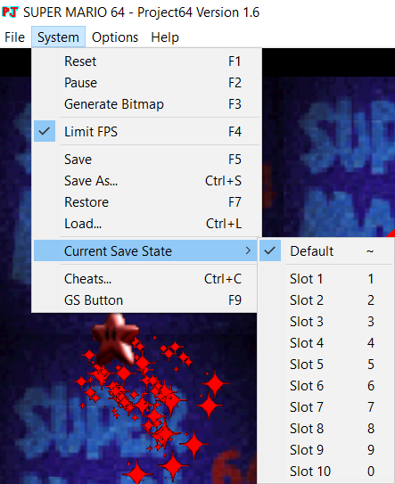
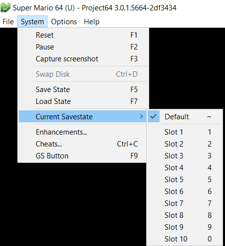
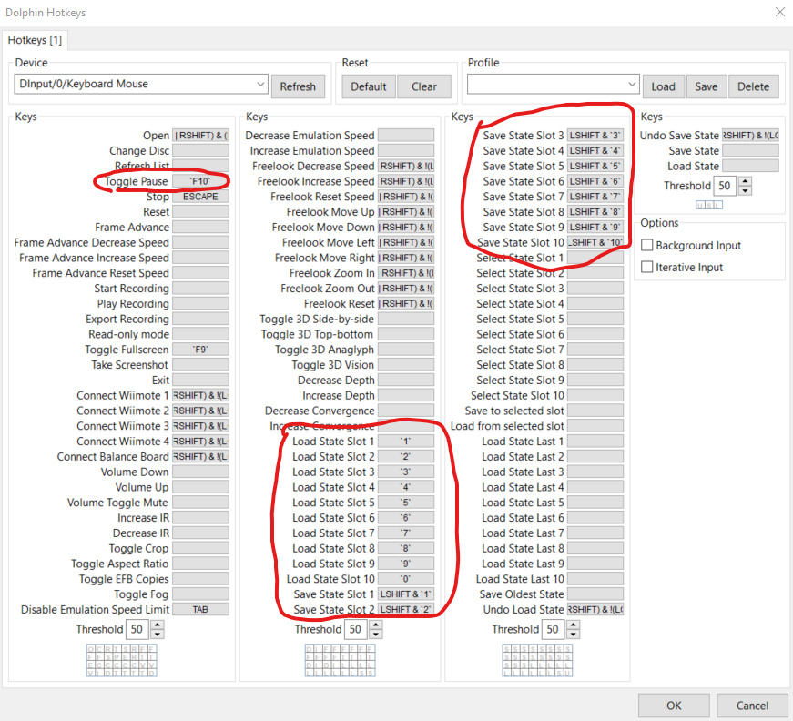

# Shuffler
##### Modified and Added to by Jeff Sinsel, Inspired and Originally Written by DouglasDouglas

Shuffle between up to 10 save states randomly on your favorite emulators. When you finish (or fail) a save file, press space to remove it from the pool of saves. After every save is finished, the game is over. The only limit is your creativity (and the 10 save slots).

## Setup

### General

The first thing you need to do is download release.zip and unzip it to your desired location. Inside will be 2 file: **shuffler.exe and config.py**. 
- Shuffler.exe is the program you will run when you want to use the shuffler, when you open it, it should open a command prompt and give you directions from there.
- Config.py contains all of the options and an explantion for all those options (this information is also included later in this document). This can be opened by any text editor such as notepad.
   
To start, you will need to pick a platform. This is done by setting either `PLATFORM_N64` to True for N64 or `PLATFORM_GCN` to True for Gamecube in config.py. It is very important that **ONE AND ONLY ONE PLATFORM IS SET TO TRUE**.  
The current emulators that are supported are Project 64 for Nintendo 64 and Dolphin for Gamecube. More may come in the future. Other emulators could possibly be used if you can adjust the keys for save states, but that is a future project.

### Project 64

For Project 64, all you need to do is make sure some keybinds are set correctly.
In config.py, you will see 3 Emulator Keybind settings for N64. 
The first one, `N64_SAVE_STATE`, defaults to F5 and is listed next to Save. 
The second one, `N64_LOAD_STATE`, defaults to F7 and is listed next to Restore in older versions and Load State in newer versions.
The third one, `N64_PAUSE`, defaults to F2 and is listed next to Pause.

Project64 v1.6:

Project64 v3.0:

### Dolphin

For Dolphin, we will need to alter some keybinds in order to make this work.
When in Dolphin go `Options > Hotkey Settings`, and then we are going to want to alter the load state and save state options.

Make all of the Load State Slots have a keybind equal to its number. And then make all the Save State Slot have keybind equal to LSHIFT & \`its number\`. You can also change pause if you would like. Remember to update `GCN_PAUSE` in config.py.

In the end yours should look like this: 

## Config Options

These options allow customization of various aspects of the Shuffler's behavior, such as platform compatibility, key bindings, optional features, and text-to-speech settings.

### Platform Compatibility

Shuffler supports two platforms: Nintendo 64 (N64) and GameCube (GCN). Only one platform should be set to `True` at any given time.

#### N64
- `PLATFORM_N64`: Set to `True` if using Project 64. Otherwise, set to `False`.

#### GCN
- `PLATFORM_GCN`: Set to `True` if using Dolphin Otherwise, set to `False`.

### Emulator Keybinds

These settings ensure that the keybinds in Shuffler match those in the emulator being used.

#### N64
- `N64_SAVE_STATE`: Save state key in Project 64.
- `N64_LOAD_STATE`: Load state key in Project 64.
- `N64_PAUSE`: Pause key in Project 64.

#### GCN
- `GCN_PAUSE`: Pause key in Dolphin.

### Basic Default Settings

These settings control the basic operation of Shuffler.

- `FINISH_SAVE_BUTTON`: Key pressed to finish a save.
- `PAUSE_BUTTON`: Key pressed to pause the shuffler.
- `MINIMUN_SLOT_TIME`: Minimum time played in a save slot.
- `MAXIMUM_SLOT_TIME`: Maximum time played in a save slot.
- `COUNTDOWN`: Countdown duration after hitting the spacebar to begin, in seconds.

### Optional Features

These features enhance the functionality of Shuffler.

- `TIMER`: Enable a timer that returns the time when all saves are completed.
- `SEED`: Set to the same integer value as your friends for fair gameplay or consistent randomness.

### TTS Finetuning

Text-to-speech settings for announcing events during gameplay.

- `VOICE_TEXT_FINISH_SAVE`: Text announced after every save is removed.
- `VOICE_TEXT_LAST_SAVE`: Text announced when on the final save.
- `VOICE_TEXT_DONE`: Text announced when no saves are left.

### OBS Settings

Settings for integrating with OBS via websockets.

- `USING_OBS_WEBSOCKETS`: Enable to display the number of remaining games in OBS.
- `OBS_TEXT_SOURCE`: Name of the text element in OBS to update.
- `OBS_TEXT_DISPLAY`: Text to be displayed in OBS, showing the number of slots left.
- `OBS_HOST`: Hostname to connect to (default is "localhost").
- `OBS_PORT`: TCP Port to connect to (default is 4455).
- `OBS_PASSWORD`: Password for the websocket server (leave empty if authentication is not enabled).

### Advanced Default Settings

Advanced settings for controlling the behavior of Shuffler.

- `KEY_COOLDOWN`: Cooldown time between key presses, in seconds.
- `remaining_slots`: List of starting slots. Edit this list if you need to start halfway through or wish to have fewer saves to start with.